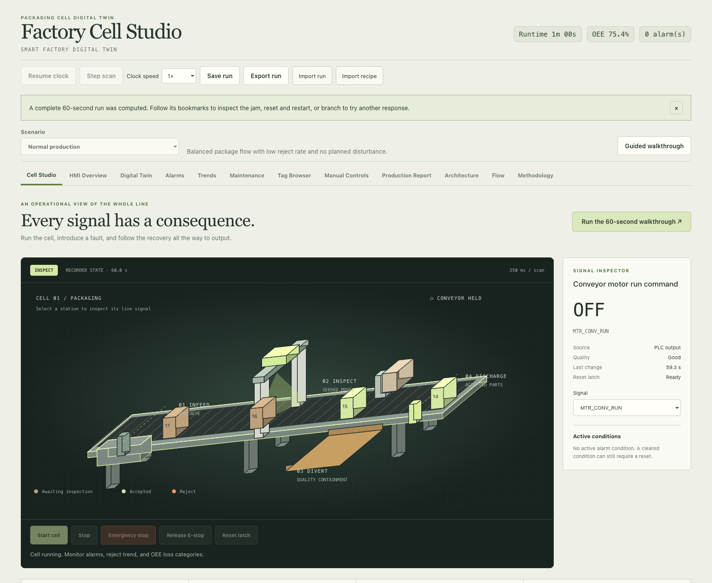

# Factory Cell Studio

An interactive packaging-cell simulator for tracing a production problem from sensor input to machine state, actuator output and lost production.

[Open the live cell](https://avi-patel-1.github.io/Smart-Factory-Digital-Twin/)

The isometric workspace runs the actual simulation in your browser. Select a station to inspect its signal, inject a jam, follow the reset sequence, and replay the exact commands that produced the result. No account or backend is required.



## Try a complete run

1. Choose **Run the 60-second walkthrough**. The app computes a seeded run and pauses at the jam.
2. Follow the bookmarks through condition clearance, Reset, separate Start and the final result. Select the conveyor or a sensor to inspect the recorded value.
3. Use the timeline to seek, or **Branch from here** to try a different response. **Return to live** returns to the run endpoint with the clock paused.
4. **Save run**, then reload. The run is rebuilt from its recipe and command log. **Export run** produces a JSON file that can be imported into a clean browser.
5. **Edit a new recipe**, change speed or reject probability, then **Compute comparison**. The 180-second baseline/candidate experiments include identical recovery rules, output and downtime comparisons, controlled transport/disturbance interventions, and a separate timeline with ghosted trajectories. **Export both runs** includes all four experiments.

**Emergency Stop → release physical input → clear other conditions → Reset → wait 2.6 seconds → Start.** Start never clears a stop. Reset never starts motion. Manual jogging obeys interlocks and holds uninspected/rejected products at their stations.

## Run locally

Use Node.js 24 or 25, npm, Git, and Python 3.12. Python uses only the standard library. macOS arm64 is exercised locally; CI runs the automated checks on Linux with Node 24.

```sh
git clone https://github.com/Avi-Patel-1/Smart-Factory-Digital-Twin.git
cd Smart-Factory-Digital-Twin
npm ci
npm run dev -- --host 127.0.0.1 --port 5173 --strictPort
```

Open `http://127.0.0.1:5173/`. Stop the server with Ctrl-C. Existing saved runs and recipes remain in that browser origin's local storage. Saving is explicit; unsaved changes are not restored after reload. Importing does not overwrite the saved run until **Save run** is used. Keep exports if you clear browser data.

```sh
npm run lint
npm test
npm run test:py
npm run build
npm run preview -- --host 127.0.0.1 --port 4173 --strictPort
```

The production preview is at `http://127.0.0.1:4173/`. Build output includes `version.json` with the actual Git revision and dirty-source flag, and `SHA256SUMS` for the deployed files. Do not identify a dirty development build as a released revision.

## Working surfaces

- **Cell Studio:** interactive isometric scene, signal inspector, alarms, cause/event timeline, command recording, bookmarks, branching, recipe editor, fault controls and comparisons.
- **HMI / Digital Twin:** detailed operator controls and an alternate equipment view.
- **Alarms / Trends / Maintenance / Tag Browser:** alarm lifecycles, recent trends, simplified maintenance indicators and searchable PLC-style signals.
- **Manual Controls:** interlocked jogging, reject gate command, photoeye forces, clock speed and single-scan stepping.
- **Production Report:** current-run CSV/JSON/Markdown exports plus a clearly separate offline historian fixture.
- **Architecture / Flow / Methodology:** data flow, timers, calculations and model boundaries.

The clock advances in fixed 250 ms scans; display speed does not change the numerical step. Each run is bounded to ten logical minutes, 4,000 commands and 50 bookmarks. Recipe files support 100 scheduled events; the local library holds 30 custom recipes. Malformed, oversized and unsupported inputs are rejected before replacing valid work. Run schema 1 / engine 2 stores inputs rather than trusting imported counters.

## External inspection contract

A recipe can require external inspection events instead of the seeded quality model. A waiting package needs a schema-1 event with event/frame/package IDs, logical capture time, decision and score. Missing results hold the line; conflicting, stale and duplicate events have explicit behavior.

To exercise the browser input, save a recipe with **External result required**, Start and wait for the package. **Prepare synthetic fixture** pauses the clock and fills the JSON editor. Submit the event; after a timeout trip, Reset and Start separately. This fixture demonstrates the protocol without implying a connected camera or FPGA. See [the full contract and example](docs/run_contract.md#external-inspection-interface).

## Architecture and validation

```text
Recipe + timestamped commands
            ↓
Fixed scan → input sampling → state/timers → outputs/counts
            ↓                         ↓
       tags / alarms             production ledger
            ↓                         ↓
       scene / inspector       OEE / reports / comparisons
            ↖ replay reconstructs the same state ↗
```

`src/plc/scanCycle.ts` owns controls, product containment and accounting. `src/simulation/session.ts` validates and reconstructs runs. Recipes, inspection validation and comparison experiments are separate modules. UI components display these states; they do not invent motion or production counts.

Regression tests cover held stops in both modes, attempts to bypass recovery, one-scan faults, product conservation, slow-speed sensor behavior, an independently calculated time ledger, malformed imports, storage failure, inspection idempotency and replay/branch parity. The historian test checks SQLite exports and shift OEE against independently summed downtime intervals.

## Offline historian fixture

The Python/SQLite example is a separate three-hour synthetic shift, not a capture of the browser session. Its final cumulative counts and time accounting determine its shift OEE. To explicitly regenerate the bundled sample database and reports:

```sh
npm run data:historian
```

This command replaces `examples/packaging_cell_historian.sqlite` and generated fixture exports; ordinary app startup does not run it. The report screen labels this fixture separately from the current run. See [historian documentation](docs/historian_pipeline.md).

## Model limits

This is an educational engineering simulation. It does not commission real machinery, implement a certified safety function, or validate physical PLC wiring. Conveyor speed and quality are modeled inputs. Comparison deltas are simulated results, not measured plant gains. State residence is an observed hold; the controlled interventions test two possible constraints within this model. MTBF/MTTR displays are simple run summaries, not field reliability estimates.

[Run and inspection contract](docs/run_contract.md) · [OEE accounting](docs/oee_metrics.md) · [PLC logic](docs/plc_logic.md) · [Exports](docs/data_exports.md) · [Deployment](docs/deployment.md)

MIT License. See [LICENSE](LICENSE).
